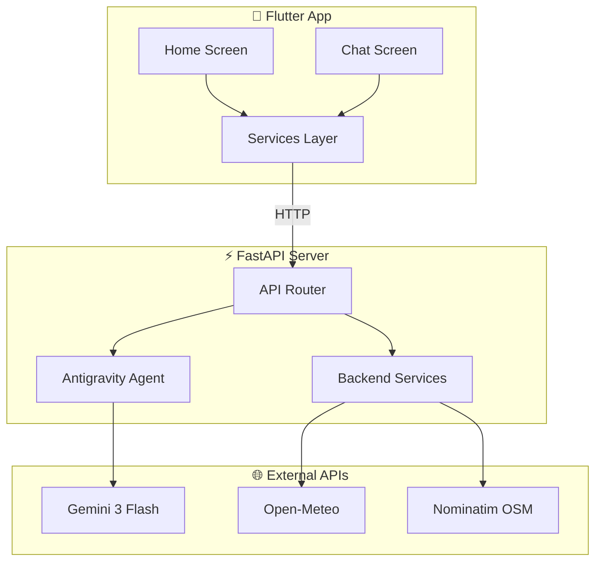
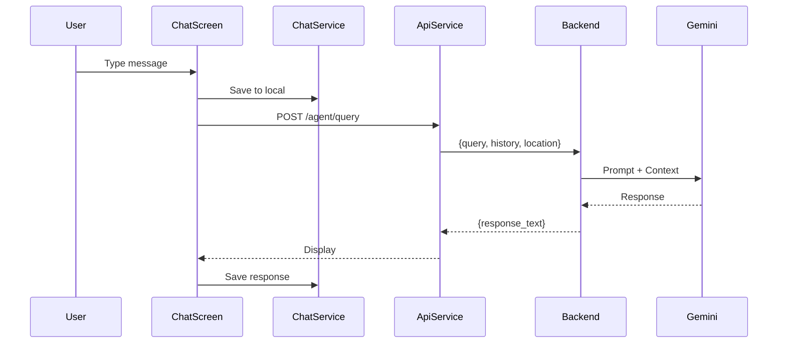
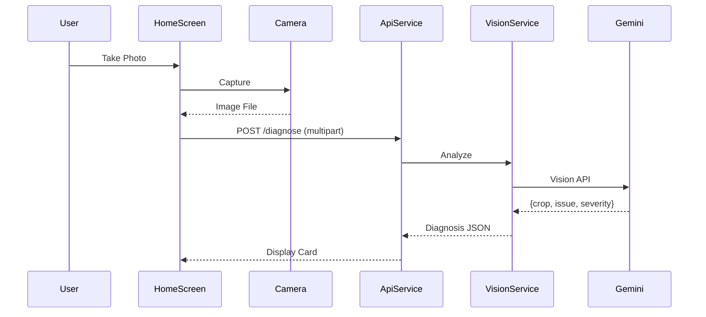

# AgriAgent Architecture v2.0

> **Last Updated**: 2026-02-07 | **Status**: Phase 4 Complete

## System Overview



---

## Component Details

### 1. Frontend (Flutter/Dart)

| File | Purpose | Dependencies |
|------|---------|--------------|
| `home_screen.dart` | Main dashboard (Weather, Markets, Diagnosis) | All services |
| `chat_screen.dart` | AI conversation interface | api_service, chat_service |
| `api_service.dart` | HTTP client to backend | dio |
| `chat_service.dart` | Local persistence (SharedPreferences) | shared_preferences |
| `location_service.dart` | GPS coordinates | geolocator |
| `weather_service.dart` | Open-Meteo API client | http |

**Key Libraries**:
- `fl_chart` - Market price graphs
- `geolocator` - Device GPS
- `shared_preferences` - Local storage
- `flutter_markdown` - Chat formatting

---

### 2. Backend (FastAPI/Python)

| File | Purpose | External Calls |
|------|---------|----------------|
| `api.py` | REST endpoints | None |
| `antigravity/core.py` | Agent reasoning loop | Gemini API |
| `antigravity/tools.py` | Tool definitions | Various |
| `services/farm_card.py` | Daily insights generator | Nominatim, Open-Meteo |
| `services/vision.py` | Crop disease analysis | Gemini Vision |
| `services/voice.py` | Speech processing | Gemini Audio |

**Key Endpoints**:
```
POST /api/v1/diagnose     → Vision analysis
POST /api/v1/agent/query  → AI chat
GET  /api/v1/daily-card   → Farm insights
```

---

### 3. External Services

| Service | Purpose | Auth |
|---------|---------|------|
| Gemini 3 Flash | Vision, NLP, Reasoning | API Key |
| Open-Meteo | Weather forecasts | None (Free) |
| Nominatim (OSM) | Reverse geocoding | None (Rate Limited) |

---

## Data Flow Diagrams

### Chat Flow


### Diagnosis Flow


---

## Current Implementation Status

| Feature | Status | Notes |
|---------|--------|-------|
| Crop Diagnosis (Vision) | ✅ Complete | Gemini Vision API |
| AI Chat | ✅ Complete | Context-aware, history-enabled |
| Weather Integration | ✅ Complete | Open-Meteo API |
| Location Services | ✅ Complete | GPS + Reverse Geocoding |
| Chat Persistence | ✅ Complete | SharedPreferences |
| Market Charts | ✅ Complete | Mock data, multi-crop selector |
| Voice Input/Output | 🔄 Partial | Backend ready, frontend pending |
| Real Market Data | ⏳ Planned | Needs API source |
| Real News Feed | ⏳ Planned | Needs RSS/scraping |

---

## Security Considerations

| Area | Current State | Risk Level |
|------|---------------|------------|
| API Keys | Hardcoded in `.env` | 🟡 Medium |
| CORS | Allow all origins | 🔴 High (Dev Mode) |
| Input Validation | Basic Pydantic | 🟡 Medium |
| Rate Limiting | None | 🟡 Medium |
| HTTPS | Not enforced | 🔴 High (Prod) |

---

## File Structure
```
AgriAgent/
├── backend/
│   ├── main.py              # FastAPI entry
│   ├── requirements.txt
│   └── app/
│       ├── api.py           # REST routes
│       ├── schemas.py       # Pydantic models
│       ├── antigravity/     # AI Agent
│       │   ├── core.py
│       │   └── tools.py
│       └── services/        # Business logic
│           ├── farm_card.py
│           ├── vision.py
│           └── voice.py
├── frontend/
│   ├── pubspec.yaml
│   └── lib/
│       ├── main.dart
│       ├── models/
│       ├── screens/
│       ├── services/
│       ├── utils/
│       └── widgets/
└── docs/
    ├── architecture.md      # This file
    └── process/
        ├── roadmap.md
        └── audit.md         # Pre-release audit
```

---

## Release & Build Notes (APK)

- Build environment: Flutter SDK (matching project version), Android SDK (platform 33+), JDK 11+.
- Emulator vs physical device:
    - For Android Emulator use `10.0.2.2` to reach host `localhost` services.
    - For physical devices use your machine LAN IP (set `AppConstants.baseUrl` accordingly).

### Producing a Release APK (local)

1. From the `frontend` folder run:

```bash
flutter build apk --release
```

2. Output APK is at `frontend/build/app/outputs/flutter-apk/app-release.apk`.

3. To share via GitHub Releases, either upload the APK manually to a release, or create a CI workflow that builds and attaches the APK automatically (we add a sample GitHub Actions workflow in the repo).

### CI Release (recommended)

- A GitHub Actions workflow can build the release APK on push or tag, then create a GitHub Release and upload the APK as an asset. The sample workflow added to this repository uses the repo's `GITHUB_TOKEN` and runs on pushes to `main` or when a tag is created.

---

If you want, I can build the APK here and add it to the repository temporarily, but it's better to use the CI workflow to avoid committing large binaries into git.
