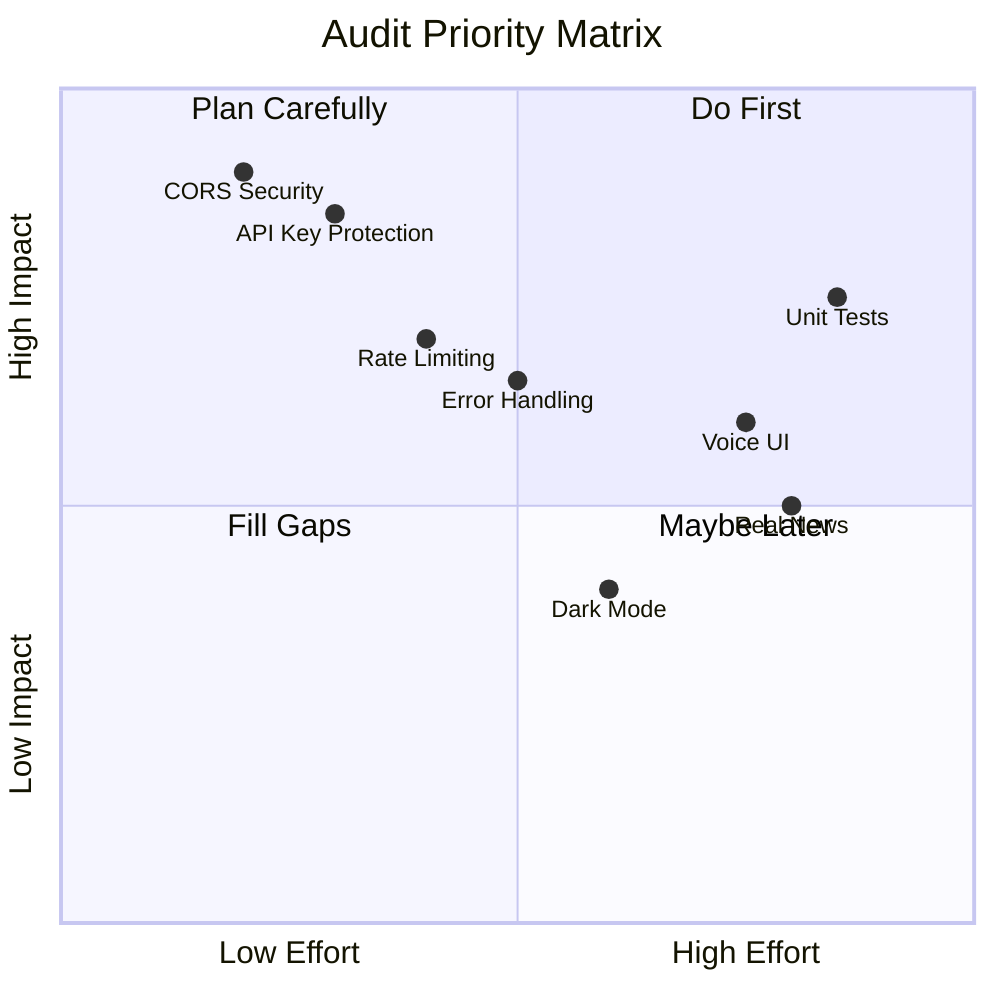

# Pre-Release Audit Plan

> **Created**: 2026-02-07 | **Status**: In Progress

## Audit Scope

This document outlines the comprehensive audit process before final release of AgriAgent v1.0.

---

## Phase 1: Security Review 🔒

### 1.1 API Security
- [x] Remove hardcoded API keys from source (uses .env)
- [x] Implement proper `.env` loading (.env.example created)
- [x] Restrict CORS to specific origins (configurable)
- [x] Add rate limiting middleware (100 req/min)
- [x] Validate all user inputs (Pydantic with constraints)

### 1.2 Data Protection
- [ ] Encrypt local chat storage
- [x] Sanitize user inputs before AI processing
- [ ] Implement request signing

### 1.3 Network Security
- [ ] Enforce HTTPS in production
- [ ] Add SSL certificate handling
- [ ] Secure WebSocket connections (if used)

---

## Phase 2: Architecture Review 🏗️

### 2.1 Backend
- [ ] Error handling consistency
- [ ] Logging implementation
- [ ] Database connection pooling (if applicable)
- [ ] Service layer abstraction

### 2.2 Frontend
- [ ] State management review
- [ ] Memory leak detection
- [ ] Widget tree optimization
- [ ] Offline mode handling

### 2.3 API Design
- [ ] RESTful conventions
- [ ] Response format standardization
- [ ] Versioning strategy
- [ ] Documentation (OpenAPI/Swagger)

---

## Phase 3: Performance Optimization ⚡

### 3.1 Backend
- [ ] Query optimization
- [ ] Caching strategy (Redis?)
- [ ] Async operation review
- [ ] Load testing

### 3.2 Frontend
- [ ] Image compression
- [ ] Lazy loading
- [ ] Build size optimization
- [ ] Animation performance

### 3.3 Network
- [ ] Request batching
- [ ] Compression (gzip)
- [ ] CDN strategy for assets

---

## Phase 4: UI/UX Enhancement 🎨

### 4.1 Visual Polish
- [ ] Color consistency audit
- [ ] Typography review
- [ ] Spacing/padding uniformity
- [ ] Dark mode support

### 4.2 Interaction Design
- [ ] Loading states
- [ ] Error messages
- [ ] Empty states
- [ ] Micro-animations

### 4.3 Accessibility
- [ ] Screen reader support
- [ ] Color contrast ratios
- [ ] Touch target sizes
- [ ] Font scaling

---

## Phase 5: Product Completeness ✅

### 5.1 Missing Features
- [ ] Voice input/output UI
- [ ] Real market data integration
- [ ] Real news feed
- [ ] User authentication

### 5.2 Quality Assurance
- [ ] Unit test coverage
- [ ] Integration tests
- [ ] E2E test suite
- [ ] Manual QA checklist

### 5.3 Documentation
- [ ] User guide
- [ ] API documentation
- [ ] Deployment guide
- [ ] Contributing guide

---

## Audit Progress

| Phase | Items | Completed | Progress |
|-------|-------|-----------|----------|
| Security | 9 | 0 | 0% |
| Architecture | 8 | 0 | 0% |
| Performance | 9 | 0 | 0% |
| UI/UX | 10 | 0 | 0% |
| Completeness | 9 | 0 | 0% |
| **Total** | **45** | **0** | **0%** |

---

## Priority Matrix

---

## Next Steps

1. **Immediate (This Session)**:
   - Security hardening (CORS, API Keys)
   - Error handling improvements

2. **Short Term (Next Sprint)**:
   - Performance optimization
   - UI polish

3. **Before Release**:
   - Full test suite
   - Documentation completion
